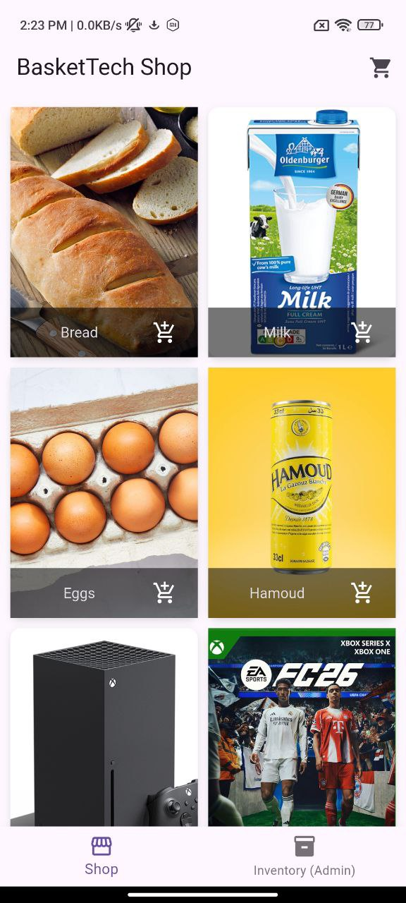
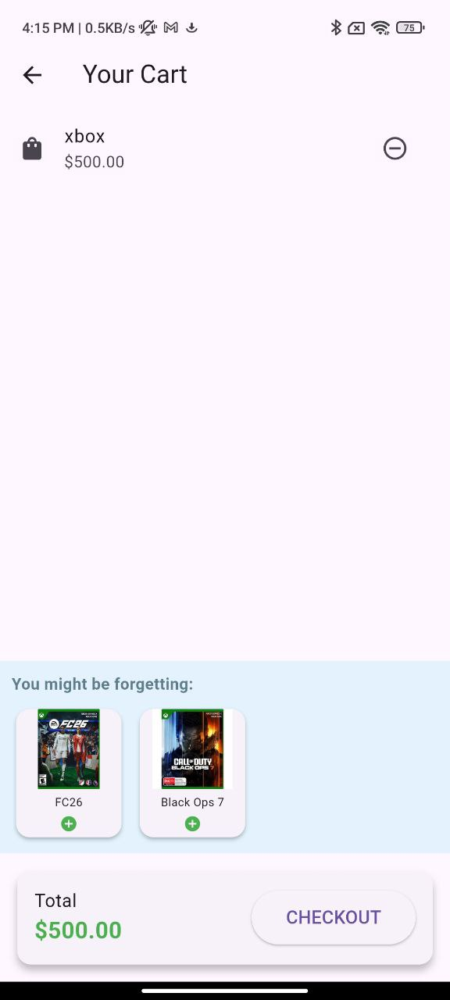

# Apriori Store (BasketTech)

A Flutter-based concept application that demonstrates the **Apriori algorithm** for on-device product recommendations. This app functions as both a Point of Sale (POS) and a shopping interface, tracking transactions and using historical purchase data to generate association rules (e.g., "People who buy Bread also buy Butter").

## 📱 Project Overview

**Goal:** To demonstrate how machine learning algorithms like Apriori can be implemented purely on-device (without a backend) to provide smart recommendations in a retail context.

**Core Concept:**
The app tracks user transactions and analyzes them to find frequent item sets. These patterns are used to suggest relevant products during browsing and checkout.

## ✨ Features

### 🛍️ Shopping & Transactions (User View)
- **Product Catalog:** Browse available items.
- **Smart Product Details:** View specific items with **Contextual Recommendations** (items frequently bought with the current product).
- **Cart System:** Add multiple items to a cart.
- **Smart Checkout:** Receive **Cart-Based Recommendations** based on the combination of items currently in your cart.
- **Transaction Recording:** Complete purchases to feed the recommendation engine.

### 🏪 Product Management (Merchant View)
- **Inventory Management:** Create, update, and delete products.
- **Data Control:** Manage the local product database.

### 📊 History & Analytics
- **Transaction History:** View a log of all past orders.
- **Rule Visualization:** (Optional) Debug view to see generated association rules (e.g., `{Diapers} -> {Beer} [Confidence: 80%]`).

## 🛠️ Tech Stack

- **Framework:** [Flutter](https://flutter.dev/)
- **Language:** Dart
- **Database:** [SQFlite](https://pub.dev/packages/sqflite) (Local, on-device storage)
- **State Management:** [Provider](https://pub.dev/packages/provider)
- **Processing:** In-app synchronous/isolate-based calculation (No backend required)

## 📸 Screenshots

| Shop Screen | Product Details | Cart & Checkout |
|:-----------:|:---------------:|:---------------:|
|  |  |  |
| *Browse Products* | *See Recommendations* | *Smart Suggestions* |

*(Note: Please add screenshots to a `docs/screenshots` folder)*

## 🚀 Getting Started

### Prerequisites
- Flutter SDK installed
- Android Studio / VS Code configured for Flutter development

### Installation

1. **Clone the repository:**
   ```bash
   git clone https://github.com/lemmouchimds/apriori_store.git
   cd apriori_store
   ```

2. **Install dependencies:**
   ```bash
   flutter pub get
   ```

3. **Run the app:**
   ```bash
   flutter run
   ```

## 🧠 How It Works (The Apriori Algorithm)

The app implements a simplified Apriori algorithm in three phases:

1.  **Data Preparation:** Fetches transaction history and converts it into a dataset of item sets.
2.  **Rule Generation:**
    *   **Support:** Identifies frequent individual items and item pairs.
    *   **Confidence:** Calculates the probability of buying item B given item A.
    *   **Filtering:** Keeps only rules that meet minimum support and confidence thresholds.
3.  **Execution:** The heavy calculation runs asynchronously (using Flutter `compute` / Isolates) after a transaction is completed to update the `association_rules` table without freezing the UI.

## 📂 Database Schema

The app uses a local SQLite database with the following structure:

- **`products`**: Stores item details (name, price, image).
- **`transactions`**: Stores order metadata (timestamp, total).
- **`transaction_items`**: Junction table linking transactions to products.
- **`association_rules`**: Caches the calculated rules (Antecedent -> Consequent) for fast lookup during recommendations.

## 🤝 Contributing

Contributions are welcome! Please feel free to submit a Pull Request.
